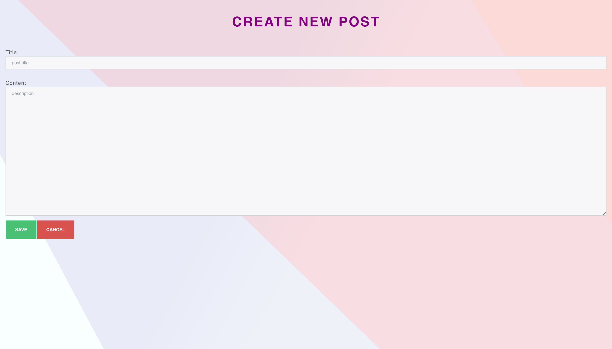

<h1 align="center">React Blog App - CRUD</h1>

React Frontend + Boostrap :)

<h1>Application Preview</h1>

<table>
  <tr>
    <td valign="top"></td>
    <td valign="top"></td>
    <td valign="top"></td>
    </tr>
      <tr>
    <td valign="top"></td>
    <td valign="top"></td>
    <td valign="top"></td>
    </tr>
    </table>

<h1>Setting up the Application</h1>

after downloading/cloning the repository code follow below steps (keep the whole code in some directory/folder first):

run following commands through terminal (iTerm probably!)

npm i

npm start

<h2>All set ! Happy coding :)</h2>
